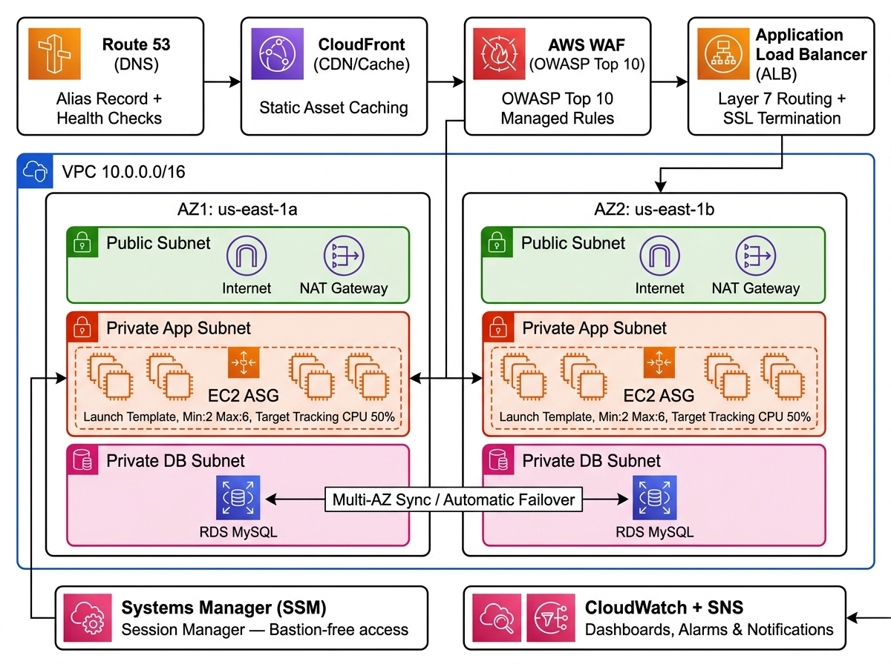

# 🚀 Scalable Web Application with ALB and Auto Scaling

[](https://www.terraform.io)
[](https://aws.amazon.com)
[](LICENSE)

A **production-grade, highly-available web application** deployed on AWS using EC2 instances inside a properly architected VPC with public and private subnets across **two Availability Zones**. The architecture achieves high availability and scalability with ALB, Auto Scaling Groups, and a CloudFront distribution for caching static assets. A Multi-AZ RDS instance serves as the database backend, with all compute running in private subnets.

---

## 📐 Solution Architecture Diagram



> **Traffic Flow:** `User → Route 53 → CloudFront → WAF → ALB → EC2 (Private ASG) → RDS Multi-AZ`

---

## 🏗️ Architecture Overview

| Layer | Service | Configuration |
|-------|---------|---------------|
| **DNS** | Route 53 | Alias record → CloudFront, health checks on ALB |
| **CDN** | CloudFront | Static asset caching, HTTPS enforcement |
| **Security** | AWS WAF | OWASP Top 10, SQL injection, rate limiting (2000 req/5min) |
| **Load Balancing** | ALB | Layer 7 routing, HTTP→HTTPS redirect, health checks on `/health` |
| **Networking** | VPC `10.0.0.0/16` | Public + Private App + Private DB subnets across 2 AZs |
| **Compute** | EC2 + ASG | Amazon Linux 2023, t3.micro, Min:2 / Max:6, Target Tracking CPU 50% |
| **Database** | RDS MySQL 8.0 | Multi-AZ, automated failover, 7-day backups, encrypted storage |
| **Access** | Systems Manager | Session Manager — no bastion host required |
| **Monitoring** | CloudWatch + SNS | Dashboard, 7 alarms, email notifications |

---

## 📁 Repository Structure

```
.
├── terraform/
│   ├── main.tf                    # Root module — orchestrates all modules
│   ├── variables.tf               # Input variable definitions
│   ├── outputs.tf                 # Output values (ALB DNS, CloudFront URL, etc.)
│   ├── terraform.tfvars           # Variable values (gitignored)
│   └── modules/
│       ├── vpc/                   # VPC, subnets (public/app/db), IGW, NAT GWs, NACLs
│       ├── security_groups/       # ALB, EC2, RDS security groups (least privilege)
│       ├── ec2_asg/               # Launch Template + ASG + scaling policies + user_data
│       ├── alb/                   # ALB, target group, listeners, health checks
│       ├── waf/                   # WAF WebACL with managed rule groups
│       ├── cloudfront/            # CloudFront distribution + cache behaviors
│       ├── rds/                   # RDS MySQL Multi-AZ + parameter group
│       ├── route53/               # Alias records + health check
│       ├── ssm/                   # IAM role + instance profile for SSM Session Manager
│       └── monitoring/            # CloudWatch dashboard + alarms + SNS topic
├── docs/
│   └── architecture.jpg           # Solution architecture diagram
├── .github/
│   └── workflows/
│       └── terraform-plan.yml     # PR-triggered Terraform plan CI
└── README.md
```

---

## ☁️ Key AWS Services

### VPC & Networking
- **VPC** CIDR: `10.0.0.0/16`
- **Public Subnets** (`10.0.1.0/24`, `10.0.2.0/24`) — ALB, NAT Gateways
- **Private App Subnets** (`10.0.11.0/24`, `10.0.12.0/24`) — EC2 instances
- **Private DB Subnets** (`10.0.21.0/24`, `10.0.22.0/24`) — RDS
- **NAT Gateways** — one per AZ for high-availability outbound access
- **NACLs** — defense-in-depth layer restricting traffic by subnet tier

### EC2 + Auto Scaling Group
- **Launch Template** — Amazon Linux 2023, IMDSv2 enforced, CloudWatch agent
- **ASG** — Min: 2 | Max: 6 | Desired: 2
- **Target Tracking (CPU 50%)** — automatic scale-out/in
- **Target Tracking (ALB 1000 req/target)** — request-based scaling
- **Instance Refresh** — rolling updates with 50% min healthy

### Application Load Balancer + WAF
- Internet-facing ALB in public subnets
- HTTP → HTTPS redirect (when ACM cert provided)
- WAF rules: OWASP Top 10, SQL injection, known bad inputs, rate limiting
- Health check: `GET /health` → `200 OK`

### CloudFront
- ALB as custom origin
- Static assets (`*.css`, `*.js`, `/static/*`) cached for 7 days
- Dynamic content passes through with no caching
- Custom `X-Custom-Header` origin verification

### RDS MySQL 8.0 Multi-AZ
- **Multi-AZ**: automatic failover to standby in AZ2
- **Storage**: 20 GB gp3, encrypted at rest
- **Backups**: 7-day retention, daily backup window
- **Enhanced Monitoring**: 60s interval
- **Performance Insights**: enabled
- Custom parameter group: UTF8MB4, slow query log

### Systems Manager — Session Manager
- IAM role with `AmazonSSMManagedInstanceCore` policy
- No bastion host, no SSH keys, no open port 22
- Connect: `aws ssm start-session --target <instance-id>`

### CloudWatch + SNS
- **Dashboard**: ALB requests, error rates, latency, ASG CPU, instance count, RDS metrics
- **Alarms**: CPU High/Low, 5xx errors, 4xx errors, unhealthy hosts, RDS CPU, RDS storage, DB connections
- **SNS**: email notifications to `m.essam357789@gmail.com`

---

## 🚀 Deployment Prerequisites

| Requirement | Version |
|-------------|---------|
| Terraform | >= 1.3.0 |
| AWS CLI | >= 2.x |
| AWS Provider | ~> 5.0 |

### AWS IAM Permissions Required
The deploying IAM user/role needs:
- `AdministratorAccess` (or scoped permissions for: VPC, EC2, RDS, ALB, CloudFront, WAF, Route53, IAM, CloudWatch, SSM, SNS)

---

## 🔧 Deployment Steps

### 1. Create Terraform State Backend

```bash
# Create S3 bucket for state storage
aws s3api create-bucket \
  --bucket scalable-web-app-tfstate-920810905747 \
  --region us-east-1

# Enable versioning
aws s3api put-bucket-versioning \
  --bucket scalable-web-app-tfstate-920810905747 \
  --versioning-configuration Status=Enabled

# Enable encryption
aws s3api put-bucket-encryption \
  --bucket scalable-web-app-tfstate-920810905747 \
  --server-side-encryption-configuration '{"Rules":[{"ApplyServerSideEncryptionByDefault":{"SSEAlgorithm":"AES256"}}]}'

# Create DynamoDB table for state locking
aws dynamodb create-table \
  --table-name scalable-web-app-tfstate-lock \
  --attribute-definitions AttributeName=LockID,AttributeType=S \
  --key-schema AttributeName=LockID,KeyType=HASH \
  --billing-mode PAY_PER_REQUEST \
  --region us-east-1
```

### 2. Configure Variables

```bash
cp terraform/terraform.tfvars.example terraform/terraform.tfvars
# Edit terraform.tfvars with your values
```

### 3. Initialize and Deploy

```bash
cd terraform

# Initialize providers and backend
terraform init

# Preview changes
terraform plan -out=tfplan

# Apply infrastructure
terraform apply tfplan
```

### 4. Access the Application

After deployment, Terraform outputs will display:
```
alb_dns_name        = "scalable-web-app-prod-alb-xxxx.us-east-1.elb.amazonaws.com"
cloudfront_domain   = "xxxx.cloudfront.net"
cloudwatch_dashboard_url = "https://console.aws.amazon.com/cloudwatch/..."
ssm_connect_command = "aws ssm start-session --target <instance-id> --region us-east-1"
```

### 5. Destroy (when done)

```bash
terraform destroy
```

---

## 🔐 Security Features

| Feature | Implementation |
|---------|---------------|
| No public EC2 | All instances in private subnets |
| No SSH / bastion | SSM Session Manager only |
| IMDSv2 enforced | `http_tokens = "required"` in Launch Template |
| WAF protection | OWASP Top 10 + SQL injection + rate limiting |
| Storage encryption | RDS encrypted at rest (AES-256) |
| Security groups | Least-privilege — EC2 only accepts from ALB SG |
| NACLs | Subnet-level network filtering |
| HTTPS | CloudFront enforces HTTPS; ALB redirects HTTP |

---

## 📊 Monitoring & Alerting

| Alarm | Threshold | Action |
|-------|-----------|--------|
| ASG CPU High | > 80% for 10 min | SNS email |
| ASG CPU Low | < 20% for 15 min | SNS email |
| ALB 5xx Errors | > 10 in 5 min | SNS email |
| ALB 4xx Errors | > 100 in 5 min | SNS email |
| ALB Unhealthy Hosts | > 0 | SNS email |
| RDS CPU High | > 75% for 10 min | SNS email |
| RDS Free Storage | < 2 GB | SNS email |
| RDS Connections | > 150 | SNS email |

---

## 📚 Learning Outcomes

- ✅ Design VPCs with correct subnet, route table, and NAT Gateway configurations
- ✅ Build highly available architectures across multiple Availability Zones
- ✅ Configure ALB listener rules and target group health checks
- ✅ Implement Auto Scaling with target tracking and step scaling policies
- ✅ Secure applications with WAF, Security Groups, and private subnets
- ✅ Use Systems Manager Session Manager as a bastion-free access alternative

---

## 👤 Author

**Mohamed Essam** ([@Moooe98](https://github.com/Moooe98))

---

## 📄 License

This project is licensed under the MIT License.
